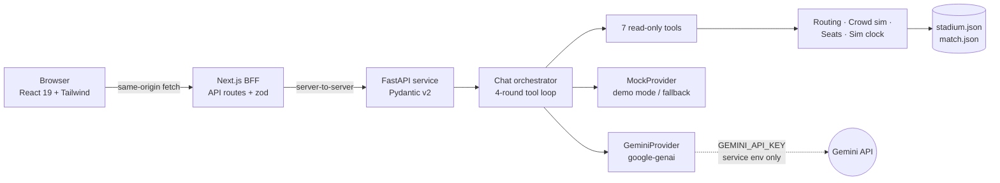
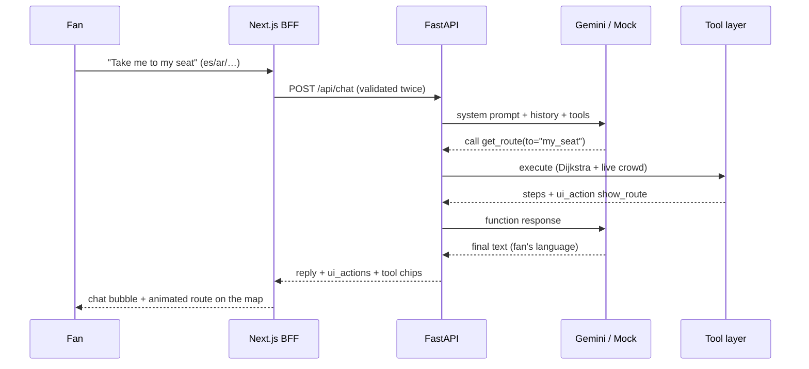

# ⚽ Stadium Copilot — Smart Stadiums & Tournament Operations

A context-aware, **multilingual GenAI assistant** for fans inside MetLife Stadium during the
**FIFA World Cup 2026 Final** — grounded navigation, crowd-aware routing, seat availability,
amenity search, exit timing, and an interactive 2D/3D stadium with a VR-style
"watch from my seat" match broadcast.

Built for **PromptWars Challenge 4: Smart Stadiums & Tournament Operations**.

> **Zero-config demo:** the app runs fully without any API key (deterministic demo mode).
> Add a free Gemini key and the same assistant switches to live Google Gemini with
> function calling. See [Quickstart](#quickstart).

---

## Chosen vertical

**Fan-facing stadium navigation + multilingual assistance.**

Persona: an international fan at the World Cup Final (July 19, 2026, MetLife Stadium,
East Rutherford NJ) holding a ticket for **Section 324, Row 12, Seat 7, Gate C**. They may
speak Spanish, Arabic, French, Portuguese, German, or English. They need to find their seat,
halal food, restrooms, a prayer room or a sensory room, avoid the worst crowds, check the
score, and know when to leave to catch the train — all from one assistant.

The solution also touches the neighbouring verticals the challenge lists: **crowd
management** (live congestion simulation drives routing), **accessibility** (step-free
routing, sensory room, RTL UI), and **real-time decision support** (phase-aware exit
advice).

## How GenAI is used (central, not decorative)

The assistant is **Google Gemini** (`gemini-2.5-flash`) running a **manual function-calling
loop** in the Python service. The model never free-styles stadium facts: it must call one of
seven **read-only, validated tools**, and every reply in the UI shows *"grounded via
&lt;tool&gt;"* chips as evidence.

| Tool | What it grounds |
|---|---|
| `get_ticket_context` | Ticket, seat zone, entry gate, inferred current location |
| `get_match_info` | Phase, scoreboard minute, live (scripted) score and goals |
| `find_amenities` | Nearest restrooms, food stalls, water, first aid, prayer/sensory rooms, merch — with dietary filters (halal, vegan, vegetarian, gluten-free) |
| `get_route` | Congestion-aware walking routes; `accessible=true` forces step-free paths |
| `get_crowd_status` | Live congestion per zone or a busiest/calmest summary |
| `find_available_seats` | Sections with box-office/resale seats left, sorted by count |
| `get_transit_advice` | Phase-aware rail/bus/rideshare exit guidance |

Gemini's multilinguality answers each fan in the language they wrote. Tool results also
carry **`ui_actions`** — typed payloads (`show_route`, `highlight_amenities`,
`highlight_zone`) that draw the answer on the stadium map, so "take me to my seat" produces
both numbered steps *and* an animated route line.

**Demo mode:** without a key, a deterministic `MockProvider` (multilingual keyword intents)
drives the *identical* orchestrator and tool layer — judges see real routes, real crowd
logic, and real seat data with zero setup. If a live Gemini call fails (rate limit, outage),
the service retries once and then falls back to the mock for that turn — the demo never
hard-fails.

## Logical decision-making beyond the LLM

The model plans; deterministic engines decide:

- **Congestion-aware routing** — Dijkstra over a hand-authored 21-zone / 34-edge multigraph
  of MetLife Stadium (4 gates, 8 concourse quadrants, 8 section clusters, rail plaza).
  Edge cost = base walk seconds × the average congestion multiplier of its endpoints, so a
  packed east concourse genuinely pushes routes the long way around. Stairs and elevators
  are parallel edges; **accessible mode** removes stairs entirely.
- **Crowd simulation** — a pure function of (zone kind, match minute, seed): keyframe curves
  encode the match-day story (gate rush before kickoff, halftime concourse spikes, post-match
  transit crush) plus seeded smoothed noise. Same seed ⇒ same timeline, every run.
- **Seat availability** — per-section sales curve that tightens toward kickoff, with
  "hospitality release" sections keeping small blocks available. Deterministic and monotonic.
- **Accelerated match clock** — the demo starts 45 min before kickoff and runs at 30×, so a
  five-minute judging session sweeps pre-match → kickoff → halftime → full-time egress.

## Feature tour

- **Chat copilot** with quick actions (Find my seat · Halal food · Restrooms · Accessible
  route · When should I leave?), tool-grounding chips, and localized route-step cards.
- **2D live map** — zones colored by congestion, chat-driven route polylines, amenity
  markers with walk times, pulsing zone highlights.
- **3D stadium** — 56 sections in two tiers, colored by **crowd density** or **seat
  availability**; hover/click any stand for details and ask the copilot to route you there;
  a gold beacon marks *where the fan currently is* (gate before kickoff, seat after).
- **VR-style seat view** — the camera flies to the fan's seat and a simulated **live
  broadcast** plays on the pitch: 22 players and the ball move deterministically, scripted
  goals fire at the right minute with LIVE scoreboard and goal banners.
- **Six locales** (EN, ES, FR, AR, PT, DE) with full RTL support for Arabic; the assistant
  itself answers in whatever language the fan types.

## Architecture



The browser never talks to the Python service or Gemini directly: the **Next.js BFF**
proxies everything, and the API key lives only in the service environment.



## Quickstart

Prereqs: **Node ≥ 20** and **Python ≥ 3.11**. Two terminals.

**Terminal 1 — Python service** (GenAI + engines, port 8000):

```bash
cd service
python -m venv .venv
# Windows PowerShell:        .venv\Scripts\Activate.ps1
# macOS / Linux:             source .venv/bin/activate
pip install -r requirements.txt
python run.py
```

**Terminal 2 — web app** (port 3000):

```bash
cd web
npm install
npm run dev
```

Open **http://localhost:3000** — that's it. Without a key the header shows **Demo mode**
and everything works offline.

> **Windows note:** clone to a reasonably short path (e.g. `C:\dev\stadium-copilot`).
> The `google-genai` package contains deeply nested files, and very long clone paths can
> hit the legacy 260-character limit during `pip install` unless
> [long paths are enabled](https://pip.pypa.io/warnings/enable-long-paths).

**With live Gemini:** get a free key at [aistudio.google.com/apikey](https://aistudio.google.com/apikey), then:

```bash
cd service
cp .env.example .env    # put your key in GEMINI_API_KEY=...
python run.py           # restart; /health now reports provider "gemini"
```

## Environment variables (all optional)

| Variable | Default | Purpose |
|---|---|---|
| `GEMINI_API_KEY` | *(empty)* | Enables live Gemini; empty = demo mode |
| `GEMINI_MODEL` | `gemini-2.5-flash` | Gemini model for chat |
| `CROWD_SEED` | `2026` | Deterministic crowd/seat simulation seed |
| `DEMO_SPEED` | `30` | Sim-minutes advanced per real minute |
| `DEMO_START_OFFSET_MIN` | `-45` | Sim start relative to kickoff |
| `WEB_ORIGIN` | `http://localhost:3000` | CORS allowlist |
| `HOST` / `PORT` | `127.0.0.1` / `8000` | Service bind address |
| `SERVICE_URL` (web) | `http://127.0.0.1:8000` | Where the BFF finds the service |

## API overview

| Endpoint | Purpose |
|---|---|
| `POST /api/chat` | `{session_id, message ≤500 chars, locale}` → `{reply, ui_actions[], tool_calls[], provider}` |
| `GET /api/stadium` | Zones, edges, amenities, SVG viewbox (static per run) |
| `GET /api/crowd` | Live congestion per zone + phase + fan position (`fan_zone_id`) |
| `GET /api/seats` | Per-section seat availability |
| `GET /api/context` | Match fixture, ticket, sim clock, provider, locales |
| `GET /health` | Status + active provider |

`ui_actions` contract (discriminated union, validated with zod client-side and ignored if
unknown):

```json
{ "type": "show_route",          "route": { "steps": [...], "polyline": [...] } }
{ "type": "highlight_amenities", "amenities": [{ "id": "...", "eta_minutes": 4, ... }] }
{ "type": "highlight_zone",      "zone_id": "transit_hub" }
```

## Testing

```bash
cd service && pytest        # 52 tests
cd web && npm test          # 17 tests (vitest)
cd web && npm run lint
```

Covered: routing determinism and congestion rerouting, step-free paths, crowd/seat
simulation reproducibility and bounds, phase boundaries, tool filters and self-correcting
error payloads, chat API happy paths (incl. Spanish replies and Arabic grounding), input
validation and rate limiting, Gemini wire-format mapping (no network needed), ui_action
parsing, i18n fallback, quick actions, and 3D layout math.

## Security notes

- The Gemini key exists **only** in the Python service env; `.env` is gitignored and the
  key is never logged.
- Double input validation (zod at the BFF, Pydantic at the service): 500-char cap, UUID
  session ids, locale allowlist, control-character stripping.
- Sliding-window **rate limiting** (per-session and global) with `Retry-After`; denied
  requests consume no quota.
- All tools are **read-only** over fixture data — prompt injection has nothing to actuate;
  the system prompt additionally instructs the model to treat tool output and user text as
  data. Chat history is server-side, so clients cannot forge assistant turns.
- Model output renders as **plain text** (no HTML/markdown injection surface); unknown
  `ui_actions` are dropped by schema validation.
- Uniform error envelope; stack traces never leave the server. CORS locked to the web
  origin even though the browser normally never reaches the service directly.

## Accessibility & inclusion

- **Step-free routing** as a first-class tool argument (elevators instead of stairs), plus
  prayer room, sensory room, and first-aid amenities in the data and quick reach of chat.
- Six UI locales including **Arabic with full RTL layout**; the assistant replies in the
  fan's own language.
- Semantic HTML with ARIA labels, `role="log"` + `aria-live` chat, keyboard-reachable
  controls, visible focus rings, `prefers-reduced-motion` respected (map/route/typing
  animations disable), and crowd levels always paired with text — never color alone.

## Assumptions

- **All data is mock/simulated**: the stadium graph is a representative 21-zone slice of
  MetLife Stadium, and the fixture (Argentina vs France, scripted goals) is illustrative —
  the real finalists can't be known at build time.
- No real positioning: the fan's location is **inferred** (assigned gate before kickoff,
  seat afterwards) and any tool accepts an explicit `from` override.
- The demo clock is accelerated (30×) so judges see the full match-day arc; stoppage time
  is ignored (45' + 15' + 45').
- Seat availability models box-office/resale inventory, not a booking system.
- Free-tier Gemini rate limits are expected; the mock fallback keeps the demo alive.
- The "live broadcast" is a deterministic simulation — no real video stream exists for a
  2026 match.

## Limitations & future work

Real telemetry ingestion (turnstiles, queue sensors) behind the same tool interface;
streaming chat responses; OpenAPI-generated TypeScript types; more locales; WebXR for a
true headset seat view; multi-stadium support for all 16 WC2026 venues.

## Repository layout

```
service/   FastAPI + google-genai: engines, tools, providers, tests
web/       Next.js 16 App Router: BFF routes, 2D SVG map, 3D (three.js), chat UI, i18n
docs/      demo-script.md — 5-minute judge walkthrough
```

## License

[MIT](LICENSE)
